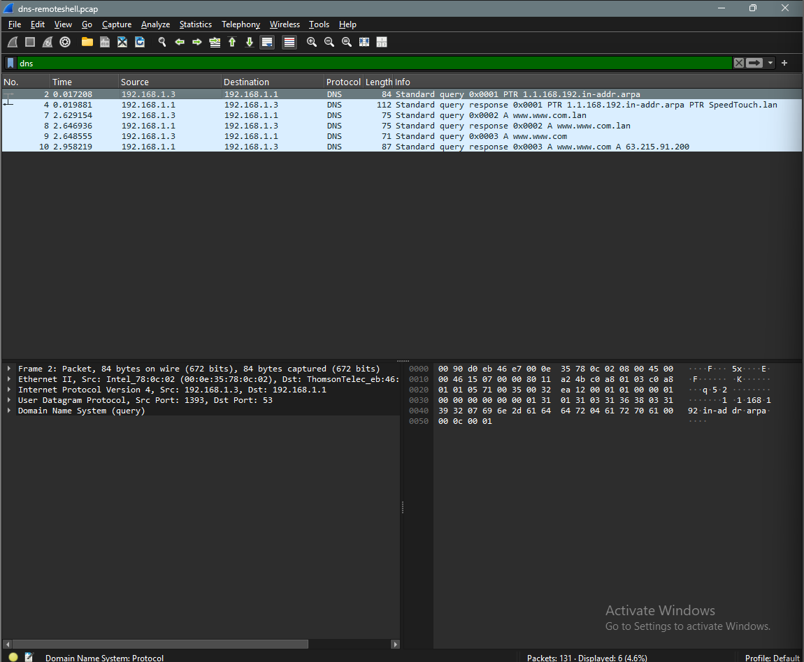
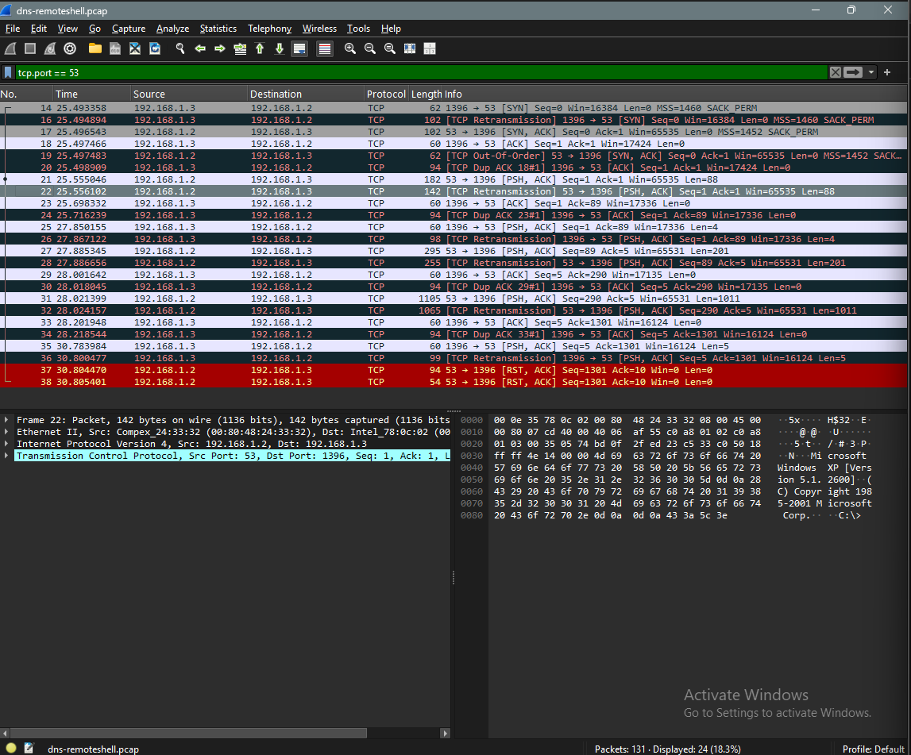

# 🛡️ Network Traffic Threat Investigation

A hands-on SOC investigation lab demonstrating how **Wireshark and PCAP analysis** can be used to identify suspicious network communication, analyze TCP sessions, reconstruct application-layer activity, and investigate potential remote shell behavior.

---

## 🎯 Objective

The objective of this investigation was to analyze a provided network packet capture and determine whether the observed communication contained suspicious activity.

The investigation focused on:

- DNS traffic analysis
- TCP communication analysis
- TCP port `53` investigation
- Packet filtering
- TCP stream reconstruction
- Payload analysis
- Windows command-shell identification
- File and directory discovery detection
- MITRE ATT&CK mapping
- SOC analyst assessment

The investigation followed a practical SOC workflow:

**PCAP → Traffic Analysis → Suspicious Connection Identification → Stream Reconstruction → Payload Analysis → Behavior Identification → MITRE Mapping → Analyst Assessment**

---

## 🔍 Investigation Scenario

A network packet capture named `dns-remoteshell.pcap` was provided for investigation.

The initial analysis showed DNS-related communication between the observed hosts.

Further packet analysis identified a TCP session involving port `53` that contained application-layer payload data.

The TCP stream was reconstructed using Wireshark's **Follow → TCP Stream** functionality.

The reconstructed communication revealed readable Windows command-shell activity, including:

```text
dir
```

followed by directory listing information and:

```text
exit
```

The observed behavior was treated as suspicious remote command-shell activity within the analyzed network capture.

---

## 🧰 Tools & Technologies

| Tool / Technology | Purpose |
|---|---|
| Wireshark | Packet capture and network traffic analysis |
| PCAP | Network evidence source |
| TCP Stream Analysis | Application-layer traffic reconstruction |
| DNS Analysis | DNS query and response investigation |
| Windows Command Shell | Identified command-line activity |
| MITRE ATT&CK | Adversary behavior mapping |
| Windows 11 VM | Analysis environment |

---

# 📊 Network Investigation

## 1. Initial DNS Analysis

The capture initially contained multiple DNS queries and responses.

Wireshark was used to filter DNS traffic and identify the communicating hosts and observed DNS activity.



### Key observations

- Multiple DNS queries were observed.
- Reverse DNS/PTR activity was present.
- DNS responses were identified.
- The observed hosts communicated using DNS-related traffic.

DNS traffic alone was not considered malicious and was used as the starting point for further investigation.

---

## 2. TCP Port 53 Analysis

Further investigation identified TCP communication involving port `53`.

A Wireshark display filter was used to isolate the relevant traffic.



### Key observations

The TCP session contained:

- TCP SYN/SYN-ACK/ACK activity
- TCP payload data
- Retransmissions
- ACK traffic
- TCP reset activity

The presence of TCP application data involving port `53` was unusual enough to justify deeper investigation.

---

## 3. TCP Stream Reconstruction

The suspicious TCP session was examined using:

**Follow → TCP Stream**

This reconstructed the application-layer conversation between the communicating hosts.


The reconstructed stream contained readable Windows command-shell information.

Observed content included:

- Windows command prompt information
- Command execution
- Directory listing output
- Windows system information
- File and directory names
- Session termination

This was the key piece of evidence that moved the investigation from simple packet analysis to behavioral analysis.

---

## 4. Windows Command Shell Activity

The reconstructed TCP stream revealed Windows command-shell activity.

The following command was observed:

```text
dir
```

The command produced directory listing information from the remote Windows system.

This behavior was mapped to:

**MITRE ATT&CK `T1083 — File and Directory Discovery`**

The stream also contained the command:

```text
exit
```

indicating termination of the observed command-shell session.

---

# 🧠 Investigation Findings

The investigation identified several indicators of suspicious network behavior:

### Network-Level Findings

- DNS queries and responses were observed.
- A TCP session involving port `53` was identified.
- The TCP session contained application-layer payload data.
- Multiple retransmissions were present.
- TCP reset activity was observed.

### Application-Level Findings

- The TCP stream contained readable Windows command-shell information.
- The `dir` command was observed.
- Directory listing information was transmitted through the session.
- The `exit` command indicated shell-session termination.

### Security Assessment

The combination of **TCP communication over port 53** and **readable Windows command-shell activity** made the session suspicious.

The activity could be consistent with:

- Protocol abuse
- Unauthorized remote access
- Covert communication
- Command-and-control behavior

However, the PCAP alone is not sufficient to conclusively determine the exact mechanism or intent.

Additional endpoint and network telemetry would be required for confirmation.

---

# 🗺️ MITRE ATT&CK Mapping

| Technique | ID | Observed Activity |
|---|---|---|
| Command and Scripting Interpreter: Windows Command Shell | `T1059.003` | Windows command-shell activity observed in TCP stream |
| File and Directory Discovery | `T1083` | `dir` command and directory listing observed |
| Application Layer Protocol: DNS | `T1071.004` | DNS-related communication and port 53 activity observed |

> **Important:** The use of TCP port `53` does not by itself prove DNS-based command-and-control. The `T1071.004` mapping is therefore treated as contextual and would require additional protocol and endpoint evidence for confirmation.

---

# ⏱️ Investigation Timeline

A detailed timeline of the observed network events is available in:

📄 [`Investigation Timeline`](Investigation/Timeline.md)

The timeline documents:

- DNS activity
- TCP connection establishment
- TCP retransmissions
- TCP payload transmission
- TCP reset activity
- TCP stream reconstruction
- Command-shell discovery

---

# 📋 Incident Documentation

Detailed investigation documentation is available in the `Investigation` directory.

### 📄 Incident Summary

[`Incident Summary`](Investigation/Incident-summary.md)

Provides an overview of the investigation, objectives, environment, observed activity, and investigation outcome.

### 📄 Investigation Timeline

[`Timeline`](Investigation/Timeline.md)

Documents the major network events and investigation sequence.

### 📄 Investigation Findings

[`Findings`](Investigation/Findings.md)

Documents the detailed technical findings, evidence, MITRE ATT&CK mapping, and analyst assessment.

---

# 🚨 SOC Analyst Assessment

The analyzed network traffic contained multiple indicators that warranted investigation.

The most significant finding was the presence of readable Windows command-shell activity within a TCP session involving port `53`.

The `dir` command demonstrated file and directory discovery behavior, while the reconstructed TCP stream provided evidence of interactive command-line activity.

In a real SOC environment, the investigation would be expanded by correlating the PCAP with:

- Windows Security logs
- Sysmon telemetry
- EDR alerts
- DNS server logs
- Firewall logs
- Proxy logs
- Endpoint process telemetry
- Authentication events
- Additional network connections

The objective would be to determine:

1. Which systems were involved
2. Whether the connection was authorized
3. Which process generated the traffic
4. Whether additional commands were executed
5. Whether persistence was established
6. Whether other hosts communicated with the same destination
7. Whether the activity represented an actual compromise

---

# 🔬 Investigation Methodology

The investigation followed a structured SOC workflow:

```text
PCAP Collection
      ↓
Initial Traffic Review
      ↓
DNS Analysis
      ↓
TCP Port 53 Identification
      ↓
Suspicious Session Isolation
      ↓
TCP Payload Analysis
      ↓
Follow TCP Stream
      ↓
Windows Command Shell Identified
      ↓
Command Analysis
      ↓
MITRE ATT&CK Mapping
      ↓
Analyst Assessment
      ↓
Investigation Conclusion
```

---

# 📚 Key Skills Demonstrated

- PCAP Analysis
- Network Traffic Analysis
- Wireshark
- DNS Analysis
- TCP Analysis
- TCP Stream Reconstruction
- Packet Filtering
- Payload Analysis
- Command-Line Investigation
- Windows Command Shell Analysis
- File and Directory Discovery Detection
- MITRE ATT&CK Mapping
- SOC Investigation Workflow
- Evidence Documentation
- Incident Assessment

---

# 🏁 Conclusion

This investigation demonstrates how a SOC analyst can use network traffic evidence to identify suspicious communication and progressively investigate it from packet-level data to application-level behavior.

The investigation progressed from:

**DNS Traffic → TCP Analysis → Port 53 Investigation → Payload Analysis → TCP Stream Reconstruction → Command Shell Identification → Behavioral Analysis → MITRE Mapping**

The analyzed traffic was ultimately assessed as **suspicious remote shell-like communication** within the provided PCAP.

The investigation demonstrates practical skills relevant to a **SOC Analyst / Security Analyst** role, particularly in network traffic analysis, evidence-driven investigation, and security event documentation.

> **Environment:** Windows 11 Virtual Machine  
> **Primary Tool:** Wireshark  
> **Evidence Source:** `dns-remoteshell.pcap`  
> **Investigation Type:** Network Threat Investigation  
> **Analysis Focus:** Suspicious TCP Communication / Remote Shell Activity
